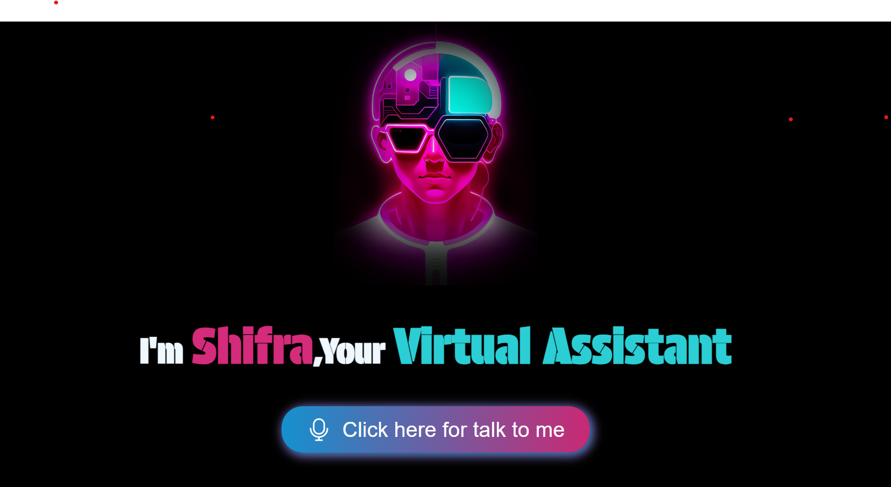

# Virtual Assistant - Shifra

## Preview

A simple web-based virtual assistant that uses speech recognition and text-to-speech to interact with users.

## Features

- Voice-activated interaction
- Time and date queries
- Open websites (Google, YouTube, Facebook)
- Search the web
- Tell jokes
- Simple calculations
- Greetings and farewells

## How to Run

1. Open `index.html` in a modern web browser that supports Web Speech API (Chrome, Firefox, etc.).
2. Click the microphone button to start listening.
3. Speak your command clearly.
4. The assistant will respond via speech and text.

## Files

- `index.html`: The main HTML structure
- `script.js`: JavaScript for speech recognition, text-to-speech, and command handling
- `style.css`: CSS for styling the interface
- `logo.jpg`: Logo image
- `mic.svg`: Microphone icon
- `voice.gif`: Animation for listening state

## Browser Compatibility

Requires a browser with support for:
- Web Speech API (SpeechRecognition and SpeechSynthesis)
- Modern ES6 features

## Troubleshooting

- If speech recognition doesn't work, ensure microphone permissions are granted.
- For best results, use a quiet environment and speak clearly.
- If text-to-speech doesn't work, check browser settings for speech synthesis.